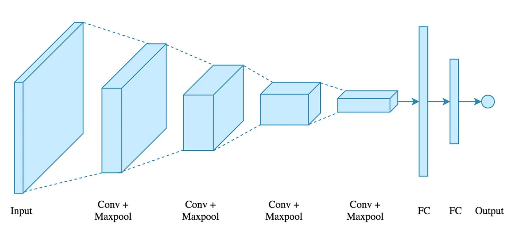
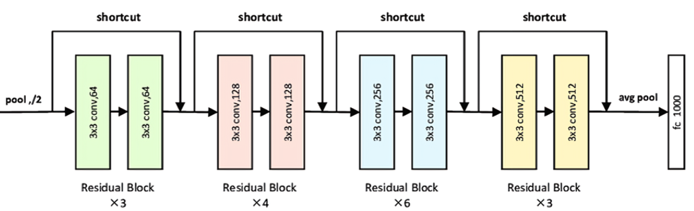

# Machine Learning Final Competition

## Task Overview 😊

Develop a model to classify song snippets into one of four categories:
- No voices present
- Male voice present
- Female voice present
- More than one person's voice

## Build-from-Scratch Models Overview

<div style="display: flex; justify-content: space-between;">
  
  
</div>

## Improvements

- **Data Pre-processing** [^1]
- **Data Augmentation**
  - Time Mask / Frequency Mask / Reverse
  - Mix-up
  - Up-sampling based on labels' weight
  - Human voice separation
- **Model Improvement**
  - Change the Input layer of ResNet
  - Ensembling
- **Choice of Hyper-Parameters / Scheduler**

| Model          | Scheduler          | Batch Size | Initial lr | Mixup Alpha | Model Weights |
|----------------|---------------------|------------|------------|-------------|---------------|
| CNN 4-layers   | MultiStepLR         | 16         | 0.001      | 0.4         | -             |
| ResNet 34      | ReduceLROnPlateau   | 16         | 0.005      | 0.4         | -             |
| ResNet34 + CNN | -                   | -          | -          | -           | 0.5, 0.5      |

[^1]: See the PDF for details.

## Performance

| Model          | Epochs | Train Loss | Validation Loss | Validation Accuracy | Test Accuracy |
|----------------|--------|------------|-----------------|---------------------|---------------|
| CNN 4-layers   | 30     | 0.3828     | 0.3531          | 85.79%              | 76.91%        |
| ResNet 34      | 24     | 0.4228     | 0.2814          | 88.52%              | 78.17%        |
| ResNet34 + CNN | -      | -          | -               | -                   | 79.44%        |

## Requirements

```bash
pip install torch
pip install librosa
